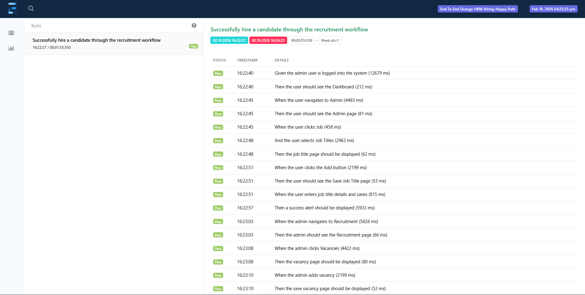
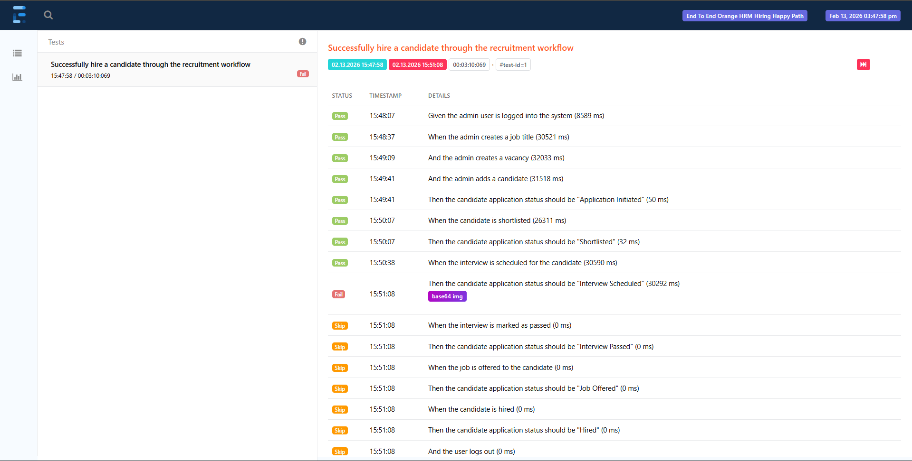

# Web Automation Testing - Enterprise Hiring Process (OrangeHRM)

## Overview

This project is an end-to-end web automation framework that validates the recruitment and hiring workflow of an HR management system (OrangeHRM).

The framework automates the complete hiring lifecycle using behavior-driven testing and production-style automation architecture.

It demonstrates:

* enterprise-level test automation design
* deterministic end-to-end workflow validation
* data-driven testing
* state-based verification
* failure reporting with screenshots

---

## System Under Test
OrangeHRM - Recruitment & Hiring Workflow

The test suite validates the full hiring pipeline:
```nginx
 Job Setup → Vacancy Creation → Candidate Lifecycle → Shortlist → Interview → Offer → Hire
```

## Scope

**In scope — End-to-End Hiring Workflow (Happy Path)**

* Admin authentication
* Job setup
* Vacancy creation
* Candidate creation
* Candidate lifecycle progression
* Hiring completion

**Out of scope**

* Candidate rejection flows 
* Offer decline scenarios 
* Negative validation testing 
* Post-hire employee validation

---

## Architecture

The framework follows a layered automation design:
```css
Cucumber Feature Files
        ↓
Step Definitions
        ↓
Page Object Model
        ↓
WebDriver Layer
        ↓
Utilities / TestRunContext / Test Data

```

**Key Design Patterns**

* Page Object Model (POM)
* Driver Factory pattern 
* Data-driven testing with JSON 
* Run-scoped test context 
* State-based assertions

---

## Framework Features

* Page Object Model implementation 
* Driver factory for browser management 
* Run-scoped unique test reference generation 
* JSON-based test data templates 
* Domain object deserialization 
* Test context for shared state across steps 
* State-based validation (not UI-only assertions)
* Screenshot capture on failure 
* Automatic HTML report generation 
* Clean separation of test logic and business data

---

## Tech Stack

* Java 17 
* Selenium WebDriver 
* TestNG 
* Cucumber (BDD)
* Extent Reports 
* Maven

---

## Project Structure

```css
├───configuration
├───reports
│   └───extent
├───screenshots
├───src
│   └───test
│       ├───Java
│       │   ├───context
│       │   ├───hooks
│       │   ├───pages
│       │   │   └───component
│       │   ├───runners
│       │   ├───stepDefinitions
│       │   ├───testdata
│       │   └───utils
│       └───resources
│           ├───features
│           └───testdata
│               ├───adminUser
│               ├───candidate
│               ├───interview
│               ├───jobCategory
│               ├───jobTitle
│               └───vacanc

```

---

## How to Run Tests

**Prerequisites**
* Java 17 installed
* Maven installed
* Browser installed (Firefox default)

**Execute Tests**

```bash
mvn clean test

```

---

## Global Preconditions

* Application accessible
* Admin user exists and is active
* Browser launched

---

## Test Case Design - Hiring Workflow

The following scenarios reflect the actual application workflow based on manual analysis.

### TC-HIRE-001 — Admin Login

**Objective:** Verify admin can log in successfully

**Steps:**

1. Navigate to Login page
2. Enter username
3. Enter password
4. Click Login

**Expected Results:**

* User is authenticated
* Dashboard is displayed

---

### TC-HIRE-002 — Create Job Category

**Objective:** Verify admin can create a job category

**Steps:**

1. Navigate to Admin → Job → Job Categories
2. Click Add
3. Enter job category name
4. Click Save

**Expected Results:**

* Job category appears in records table

---

### TC-HIRE-003 — Create Job Title

**Objective:** Verify admin can create a job title

**Steps:**

1. Navigate to Admin → Job → Job Titles
2. Click Add
3. Enter job title
4. Click Save

**Expected Results:**

* Job title appears in list

---

### TC-HIRE-004 — Create Vacancy

**Objective:** Verify admin can create a vacancy

**Steps:**

1. Navigate to Recruitment → Vacancies
2. Click Add
3. Enter vacancy name
4. Select job title
5. Select hiring manager
6. Enter positions
7. Click Save

**Expected Results:**

* Vacancy saved successfully

---

### TC-HIRE-005 — Add Candidate

**Objective:** Verify admin can create a candidate linked to a vacancy

**Preconditions:**

**Steps:**

1. Navigate to Recruitment → Candidates
2. Click Add
3. Enter candidate details
4. Select vacancy
5. Click Save

**Expected Results:**

* Candidate created
* Status = Application Initiated

---

### TC-HIRE-006 — Shortlist Candidate

**Expected Results:**

* Status = Shortlisted

---

### TC-HIRE-007 — Schedule Interview

**Expected Results:**

* Status = Interview Scheduled

---

### TC-HIRE-008 — Mark Interview Passed

**Expected Results:**

* Status = Interview Passed

---

### TC-HIRE-009 — Offer Job

**Expected Results:**

* Status = Job Offered

---

### TC-HIRE-010 — Hire Candidate

**Expected Results:**

* Status = Hired
* Candidate converted to employee

---

### TC-HIRE-011 — Logout

**Expected Results:**

* User logged out
* Login page displayed

---

## Reporting and Screenshots

Test execution produces:
* HTML execution reports
* Step logs
* Failure screenshots

see:
```bash
/reports
/screenshots

```

---

## Report Screenshots

After each test run, an interactive HTML report is generated using Extent Reports.

The report includes:
* Test execution summary (pass/fail/skip)
* Step-level logs 
* Failure details 
* Screenshot evidence for failed steps 
* Execution timestamps

**Passing Test Full Sample [Report](reports/extent/extent-report_2026_02_13_15_28_14.html)**




**Failing Test Full Sample [Report](reports/extent/extent-report_2026_02_13_15_47_57.html)**



---

## Future Improvements
* Negative test coverage
* Retry mechanism for flaky tests
* Parallel execution
* CI/CD pipeline integration
* API validation integration

---
